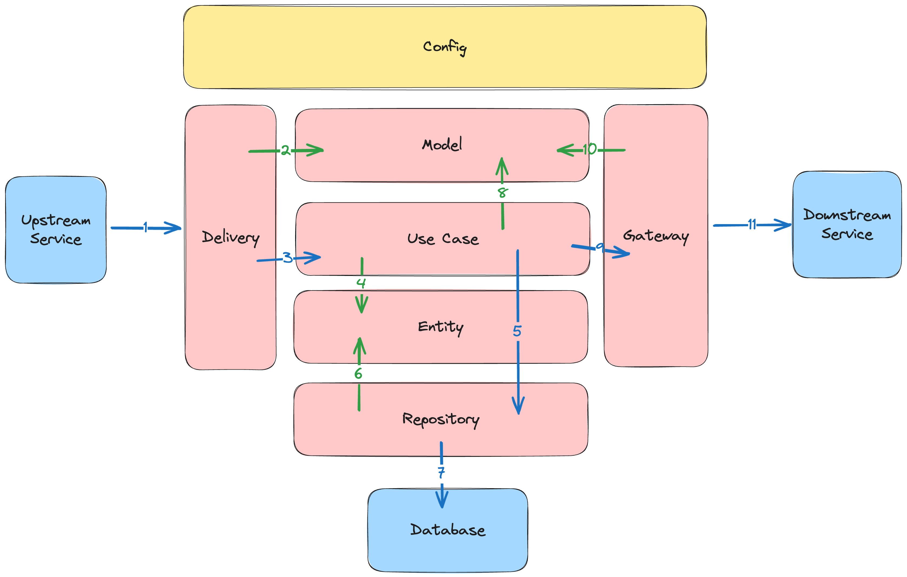

# Golang Clean Architecture Template

## Description

This is golang clean architecture template.

## Architecture



1. External system perform request (HTTP, gRPC, Messaging, etc)
2. The Delivery creates various Model from request data
3. The Delivery calls Use Case, and execute it using Model data
4. The Use Case create Entity data for the business logic
5. The Use Case calls Repository, and execute it using Entity data
6. The Repository use Entity data to perform database operation
7. The Repository perform database operation to the database
8. The Use Case create various Model for Gateway or from Entity data
9. The Use Case calls Gateway, and execute it using Model data
10. The Gateway using Model data to construct request to external system 
11. The Gateway perform request to external system (HTTP, gRPC, Messaging, etc)

## Tech Stack

- Golang : https://github.com/golang/go
- MySQL (Database) : https://github.com/mysql/mysql-server
- Docker : https://www.docker.com

## Framework & Library

- GoFiber (HTTP Framework) : https://github.com/gofiber/fiber
- GORM (ORM) : https://github.com/go-gorm/gorm
- Viper (Configuration) : https://github.com/spf13/viper
- Golang Migrate (Database Migration) : https://github.com/golang-migrate/migrate
- Go Playground Validator (Validation) : https://github.com/go-playground/validator
- Logrus (Logger) : https://github.com/sirupsen/logrus

## Configuration

All configuration is in `config.json` file.

## API Postman

All API is in `api` folder. Import json to Postman Desktop.

## Database SQL

All table is in `migrations` folder the name `init.sql`.

## Run Application

### Run unit test

```bash
go test -v ./test/
```

### Run web server using command line

```bash
go mod tidy
```

```bash
go run cmd/web/main.go
```

### Run web server using air (Mac)

```bash
go install github.com/cosmtrek/air@latest
```

```bash
export PATH=$PATH:$HOME/go/bin
```

```bash
source ~/.zshrc
```

```bash
air
```

### Run web server using docker

Change branch to `feature/docker-setup` before starting.

```bash
docker-compose up --build 
```